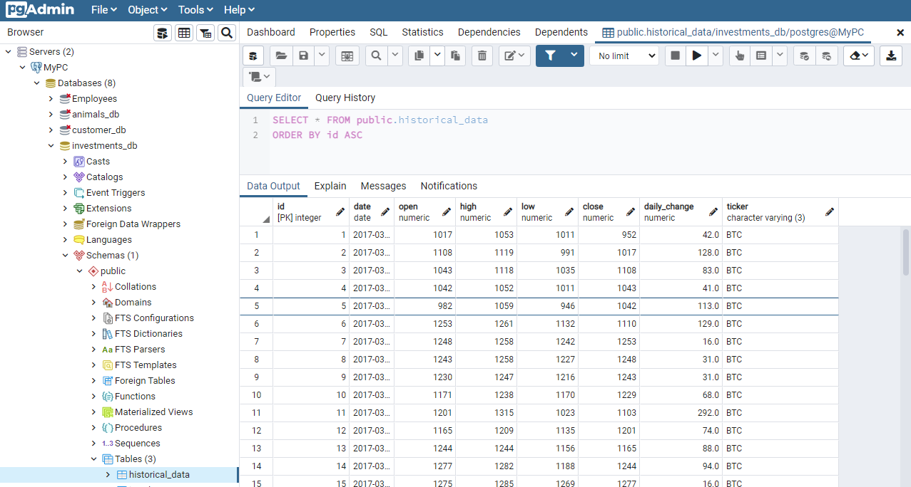

# Trendy Investments
Trending investments and their volatility:
Here we explore the historical data of Game Stop, Bitcoin and the S&P 500. We have chosen to measure their performance in the market. 

## Extract
* Listed here are links to the original Data Sources our team has used for the project. The data was pulled from Marketwatch.com and downloaded as CSV files. 
* During extraction, we pulled five files from each source to generate data from the past five years. 

  * [Bitcoin Data](https://www.marketwatch.com/investing/cryptocurrency/btcusd/download-data)

  * [S&P Data](https://www.marketwatch.com/investing/index/spx/download-data)

  * [GameStop Data](https://www.marketwatch.com/investing/stock/gme/download-data)

## Transform
* To ensure a cohesive data base, we removed unnecessary columns, replaced commas and transformed the price columns into floats.
* Data was transformed from five files to one by the tickers.
* The  `daily_change` was calculated by substractig the daily `High` and daily `Low`

## Load
* SQL was chosen as a platform for our database since we worked with clean archival data. 
* Data was loaded into one table becasuse each ticker had the same column.

